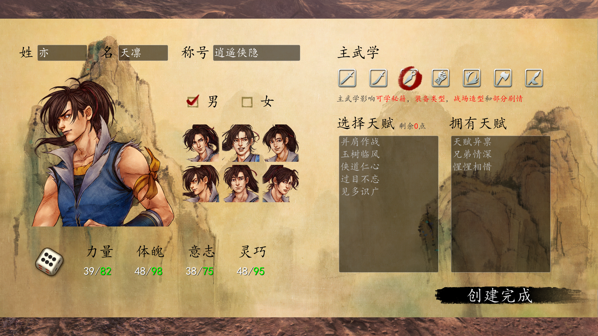
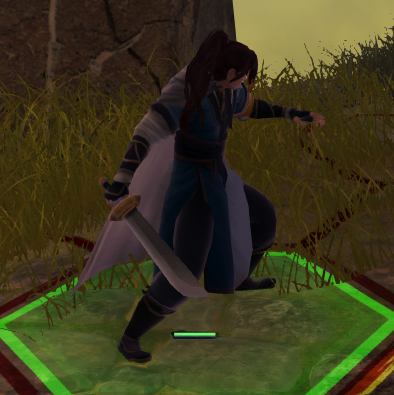
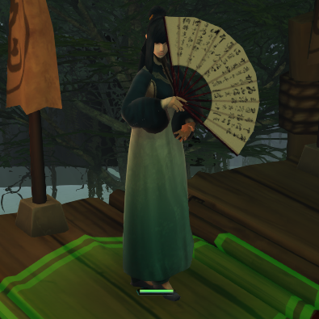
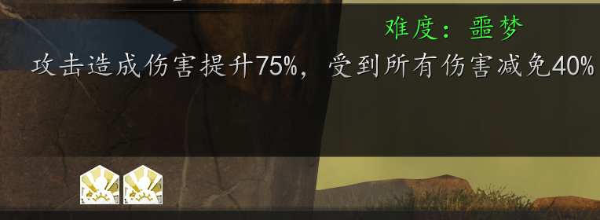
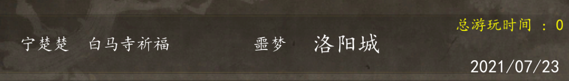
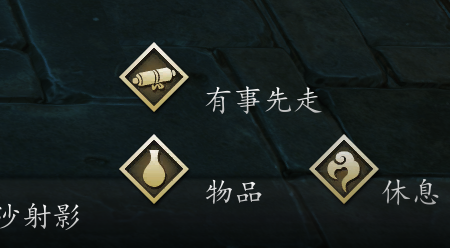

# 侠客风云传前传 侠道再起MOD

### 简介

等待侠隐阁/侠之道第三年的日子里，我翻出当年印象非常好的侠客风云传前传重玩，不过不想再走一遍老路，因此制作了这个侠道再起MOD。

此MOD的目标是打造我心目中最完美的侠客风云传前传：对游戏进行一次全面精修，同时把侠隐阁/侠之道各种好的设计移植到前传，包括可完全自定义的主角，我认为“代入感”是好RPG非常重要的一环。

### 主角相关

玩家开局时可以像侠隐阁那样完全自定义主角，包括**姓名称号头像**，甚至选择**女性主角**开始游戏。

但即使选择女主角，原版剧情、台词和动画演出也不会有任何缩水或明显穿帮，只是修改为了“百合”、“姐弟情深”。

同时可以自定义主角主武学，除了拳掌和气功路线，其他五种都将是全新体验。

主武学选择影响**战场武器模型**的和**战斗动作**，**可装备的武器类型**、**可学武功类型**、**初始数值**和**初始武功**。同时也会影响**部分剧情**，例如选不同的主武学，原天山六阳掌剧情、螺旋生死符/佛度拜火剧情得到的将是完全不同的武功。也影响部分战斗秘籍物品掉落，例如选了拳掌才有机会拿到最强单体输出野球拳。

> 刀系男主角和短柄系女主角的战场造型

设定上，主角为武学奇才，可学习所有**主武学**类型的武功（除少数特殊武功），所以辟邪剑法不一定是云华的专属了。

### 难度体系

原版游戏难度太低是很大遗憾，侠道再起MOD提供了类似侠隐阁那样的难度体系，战斗中会给非己方单位附加无法移除的难度buff，提供额外的最终伤害加成和最终减伤：

困难：伤害加成**50%** 受伤减免**30%**
噩梦：伤害加成**75%** 受伤减免**40%**
炼狱：伤害加成**100%** 受伤减免**50%**

请注意，受伤减免对反弹伤害和debuff伤害同样有效，同时攻击经验（招式）和防御经验（破剑等）是按难度buff加成前的数值计算。

另外，侠道再起MOD在任意难度下，游戏原内部难度固定为**10**（原版内部难度在最后版本1.0.2.8不影响战场数值，只影响AI等级和战后NPC的传闻数量）。

同时，游戏难度越高，战后非必定掉落的道具，掉落概率也越大，炼狱基本百分百掉落。

难度也会像侠隐阁那样，显示在存读档界面上。

### 游戏机制

侠道再起MOD提供了一些基本**快捷功能**：

- <kbd>Q</kbd>键快速跳过剧情

- 按住左<kbd>Shift</kbd>键不放奔跑

- 战场按<kbd>F2</kbd>键开启/关闭战斗信息显示

- 战场按<kbd>F3</kbd>键切换普通高速超高速三种不同的战斗速度

**四维重做**。改为力量/体魄/意志/灵巧，效果相对原版有大幅度加强，具体效果请参考游戏内说明。

钢鞭和软索合并为**短柄**。武器类型、招式类型、攻击防御数值均进行了合并，界面作了修改。原版钢鞭和软索实在太单薄了。

**连斩**改为和侠隐阁一样，每回合最多触发一次，但同时也不再消耗成倍内力。

**荆棘**和**卫紫绫**也能移出队伍，他们也有各自专属的武功天赋传闻，重招在逍遥谷的房间内。

### 天赋和特技

原版游戏在我看来有不少恶心玩家的设定，天赋这块尤甚，因此本MOD重做了很多天赋。

一部分天赋原效果现自动常驻，包括：见多识广，神农百草，矿石冶炼和毒物探索。这些天赋现在具有新的效果：

- **见多识广**改为获得阅历后，自身额外获得同数量的属性点
- **神农百草**，**矿石冶炼**和**毒物探索**改为采集对应类型时额外获得50%数量
- **明察秋毫**改为可以在战斗中查看对方身上携带的物品

侠道再起MOD提供类似侠隐阁的**特技**系统，特技不消耗行动回合，也可行动/休息后使用。

一些天赋原效果取消，改为赋予角色可主动使用的特技：

- **有事先走**，主动离场，并由随机队友原地替补上阵，离场并非离队，甚至仍能通过惺惺相惜再次满血登场

- **我佛慈悲**，使用后让周围1格的队友包括自身当回合“我佛慈悲”，cd 1

- **吃香喝辣**/**嗜酒如命**，主动吃食物喝酒，不消耗行动回合和道具cd，cd 3

- **万兽之王**，纪纹专属，召唤5种有传闻（可成长）野兽中的随机1种，为不可控友军，在高难度下非常厉害，cd 4

最后，偷窃算法得到重做，偷窃成功率有一定提升，且按照物品类型而非物品数量分布偷盗结果，偷窃不再反人类。

### 传闻

一次性的稀有传闻，例如获得武功/内功/天赋等传闻，随着未触发的时间越长，触发的概率越大（但成功触发一个稀有传闻后，概率加成会重新累积）。现在这些稀有传闻不用看脸基本都能触发，不再反人类。

NPC练功类隐藏传闻，现在若NPC已经练满所有自身的招式和内功，会继续提升基础能力（气血内力上限或未满的属性）。有传闻的NPC的成长是不容小觑的。

### 各种调整和补充

增加了**20多种**原版有但无法获取的武功，部分获取途径与“极难MOD”相同。

增加了**20多种**原创武功，多为特定武学路线专属。

杜康村增加了本传NPC洪日庆，卖几本武功秘籍。

平衡调整：辟邪剑法两招增加了内力消耗，慈悲刀法反弹伤害削弱到100%。

还有很多合理性调整和数值微调，请在游戏内确认。

### 通关后内容

侠道再起MOD通关后不会有彩蛋战，也没有未明剧情，毕竟设定上此世界线完全不存在谷月轩和东方未明，只有作为主角的玩家。

虽然现在尚未制作，但将来本MOD在通关后仍可继续游戏，通关后将有真正的高难度隐藏boss，额外剧情线（武林盟主、大战天意城），额外队友等。

### 其他

安装：解压文件至游戏根目录即可（EsperToWP.dll/opengl32.dll和YoungHero.exe同目录）。本MOD和各种快捷补丁/畅玩插件不兼容，请先卸载这些。

